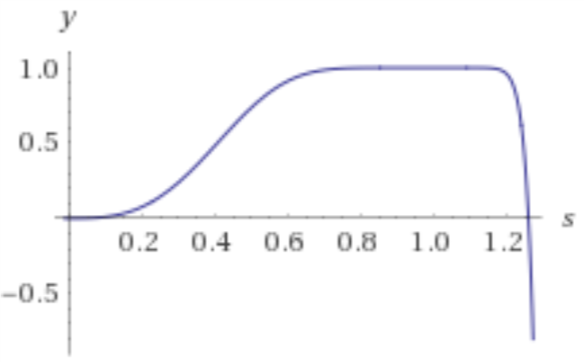
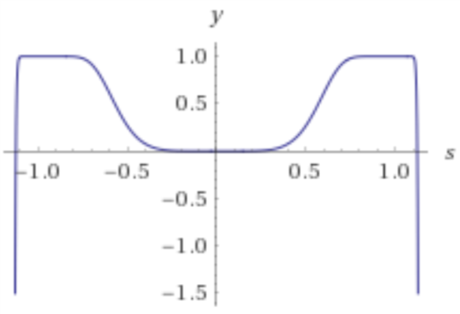
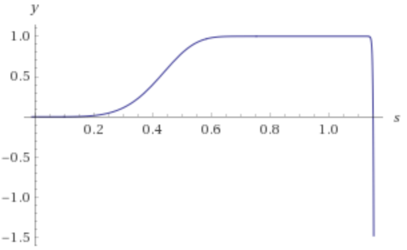

# Minhashing

## a

```
h_1(x) = (2x + 1) mod 6
h_2(x) = (3x + 2) mod 6
h_3(x) = (5x + 2) mod 6
```

|Element|S_1|S_2|S_3|S_4|(2x + 1) mod 6|(3x + 2) mod 6|(5x + 2) mod 6|
|-------|---|---|---|---|--------------|--------------|--------------|
|      0|  0|  1|  0|  1|             1|             2|             2|
|      1|  0|  1|  0|  0|             3|             5|             1|
|      2|  1|  0|  0|  1|             5|             2|             0|
|      3|  0|  0|  1|  0|             1|             5|             5|
|      4|  0|  0|  1|  1|             3|             2|             4|
|      5|  1|  0|  0|  0|             5|             5|             3|

|Hash-Function|S_1|S_2|S_3|S_4|
|-------------|---|---|---|---|
|       h_1(x)|inf|inf|inf|inf|
|       h_2(x)|inf|inf|inf|inf|
|       h_3(x)|inf|inf|inf|inf|

|Hash-Function|S_1|S_2|S_3|S_4|
|-------------|---|---|---|---|
|       h_1(x)|  5|  1|  1|  1|
|       h_2(x)|  2|  2|  2|  2|
|       h_3(x)|  0|  1|  4|  0|

## b

Only `h_3(x)` is a true permutation, as the number of input elements
equals the number of unique output elements

## c

|Element Pair |hashmin-based|true Jaccard|
|-------------|-------------|------------|
|S_1 *and* S_2|          1/3|           0|
|S_1 *and* S_3|          1/3|           0|
|S_1 *and* S_4|          2/3|         1/4|
|S_2 *and* S_3|          2/3|           0|
|S_2 *and* S_4|          2/3|         1/4|
|S_3 *and* S_4|          2/3|         1/4|


# Locality-sensitive hashing

## a
### 1−(1−s^3)^10


### 1−(1−s^6)^20


### 1−(1−s^5)^50


## b

```
1−(1−s^3)^10 = 1/2
s ~ 0.406 | s ~ 1.246

(1/10)^(1/3) ~ 0.464
```


```
1−(1−s^6)^20 = 1/2
s ~ -1.119 | s ~ -0.569 | s ~ 0.569 | s ~ 1.119

(1/20)^(1/6) ~ 0.607
```

```
1−(1−s^5)^50 = 1/2
s ~ 0.424 | s ~ 0.892 | s ~ 0.897 | s ~ 0.905 | s ~ 0.915

(1/50)^(1/5) ~ 0.457
```